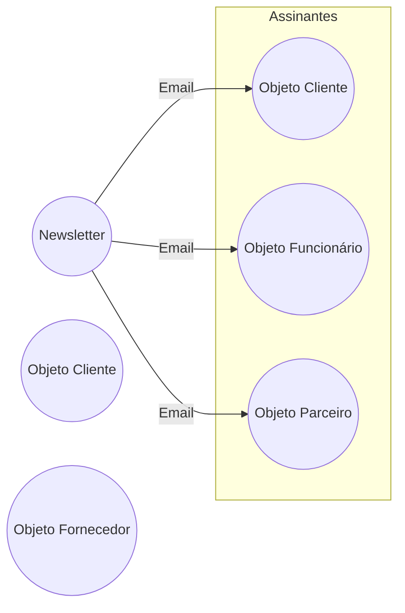
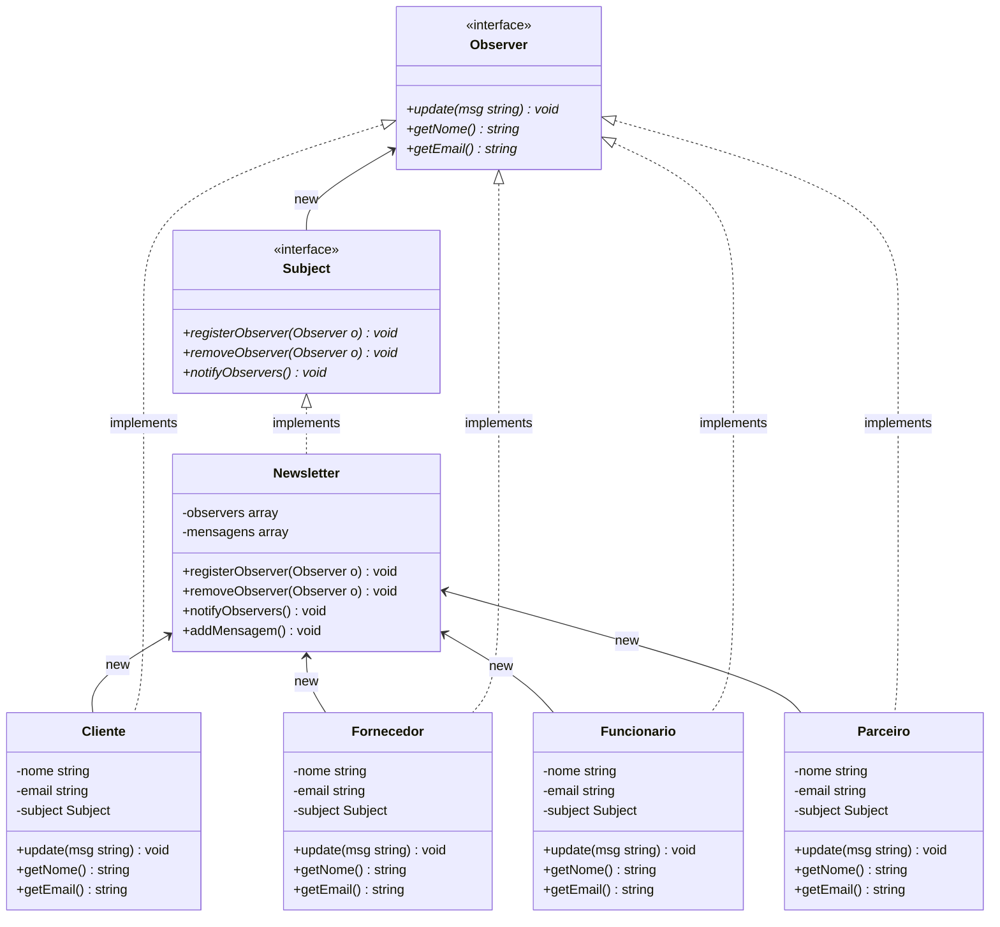
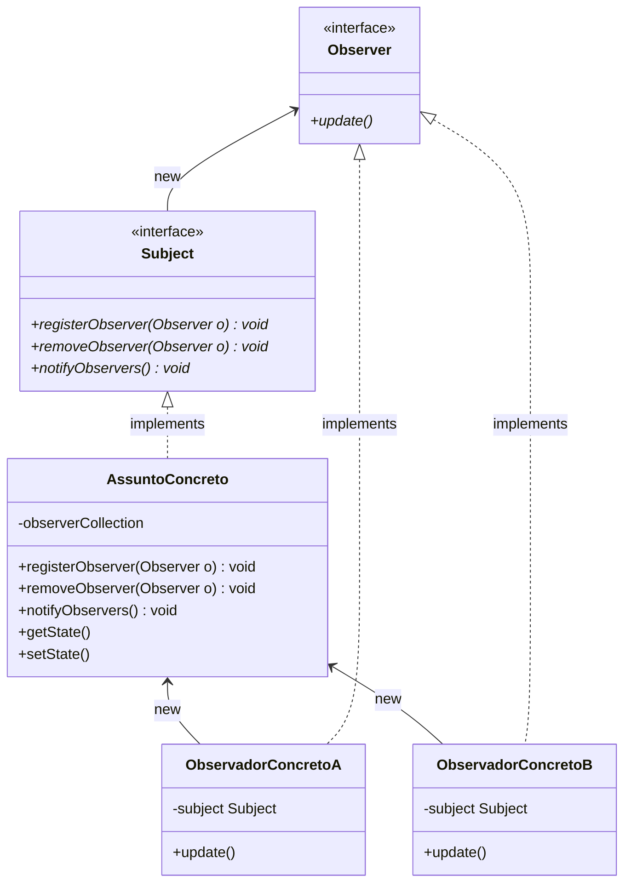

# Observer (padrão comportamental)

## Definição

O _Observer_ é um padrão de projeto de _software_ que define uma dependência um-para-muitos entre objetos, de modo que quando um objeto muda seu estado, todos seus dependentes são notificados e atualizados automaticamente.

## Motivação (Por que utilizar?)

Um sistema pode precisar manter a consistência entre objetos relacionados. Não é recomendado garantir tal consistência tendo como efeito colateral tornar as classes fortemente acopladas, pois isso reduz sua reutilização. Um objeto que se relaciona com outros objetos deve permitir que seus elementos sejam acessados sem que a sua estrutura interna seja exposta.

Para garantir que objetos dependentes entre si possam propagar suas mudanças de estado o padrão _observer_ propõe que:

- Os observadores (_observers_) devem conhecer o objeto de interesse.
- O objeto de interesse (_subject_) deve notificar os observadores quando for atualizado.

Os objetos devem interligar-se entre si sem que se conheçam em tempo de compilação. Tomemos como exemplo a implementação de uma _Newsletter_ para uma empresa (serviço de assinatura de emails) onde clientes, funcionários, parceiros e fornecedores podem se inscrever para receber emails de notícias sobre a empresa. A _Newsletter_ é nosso objeto de interesse, portanto ela é nosso _subject_ e os clientes, funcionários, parceiros e fornecedores são os _observers_.

> Esquema de notificações do padrão _Observer_

A criação de um novo e-mail é uma mudança no estado de _newsletter_, tal e-mail deve ser enviado a todos os assinantes. No esquema acima temos uma instância de **Cliente** e outra de **Fornecedor** que ainda não são assinantes da _newsletter_ e por isso não receberam e-mail, porém, tais objetos podem se tornar assinantes a qualquer momento. Da mesma forma, qualquer assinante pode cancelar sua assinatura e deixar de receber e-mails.

A _newsletter_ precisa saber como notificar todos os assinantes a respeito do novo e-mail. Para que isso seja possível, eles precisam implementar um método em comum. É possível garantir isso fazendo eles implementarem uma interface em comum.

Em nosso exemplo as classes **Cliente**, **Funcionario**, **Parceiro** e **Fornecedor** são muito parecidas, poderiam inclusive ser subclasses de uma classe mais genérica para reduzir a duplicidade de código. Isso é proposital para simplificar o exemplo e focarmos no conceito do padrão _observer_. Porém, tais classes poderiam ser completamente distintas, a única coisa que precisam ter em comum é a implementação da interface **Observer**.

Agora a _newsletter_ sabe que pode utilizar o método `update()` para notificar seus _observers_.

Da mesma forma que a _newsletter_ precisa de garantias a respeito de seus observadores, um observador precisa saber se um objeto é capaz de notificá-lo, ou seja, se o objeto é um _subject_.

Um _subject_ deve ser capaz de:

- **Adicionar** _observers_ à sua lista de objetos a serem notificados.
- **Remover** _observers_ de sua lista de objetos a serem notificados.
- **Notificar** _observers_ da sua lista de objetos a serem notificados.

É preciso criar um supertipo (interface) para os objetos observáveis para garantir aos observadores que suas necessidades serão supridas.

A _newsletter_ é nosso objeto observável, portanto, ela implementa a interface **Subject** que será esperada pelos _Observers_.

Deste modo os _observers_ têm garantia de que irão se inscrever em um objeto capaz de notificá-los sempre que existir uma nova mensagem na **Newsletter**.

Devido a utilização do padrão _Observer_ o código passa a obedecer alguns bons princípios de programação orientada a objetos:

1. **Programe para abstrações**: tanto a **Newsletter** (_subject_) quanto **Cliente**, **Funcionario**, **Parceiro** e **Fornecedor** (_observers_) usam interfaces. O _subject_ monitora os objetos que implementam a interface **Observer** enquanto os observadores registram e são notificados pela interface **Subject**.

2. **Mantenha objetos que se relacionam levemente ligados**:

- A única coisa que o _subject_ sabe sobre os _observers_ é que eles implementam a interface **Observer**.
- Tanto _Subjects_ quanto _Observers_ podem ser reutilizados separadamente, um não depende do outro de forma concreta.

3. **Open-closed principle**:

- Novos observadores podem ser adicionados a qualquer momento sem a necessidade de modificar o _subject_.
- Alterações no _Subject_ e _Observer_ não afetarão um ao outro.

4. **Dê prioridade a composição em relação à herança**: o padrão _observer_ utiliza a composição para compor, em tempo de execução, um _subject_ com qualquer número de _observers_.

> Diagrama de classes do exemplo no Cenario1

## Aplicabilidade (Quando utilizar?)

- Quando uma abstração tem dois aspectos, um depende do outro, e é necessário que eles possam variar e serem reutilizados independentemente.
- Quando uma alteração em um objeto requer a alteração de outros, e não se conhece quantos objetos precisam ser alterados.
- Quando um objeto deve ser capaz de notificar outros objetos sem os conhecer, ou seja, tais objetos não podem ser fortemente acoplados.

## Componentes

- **Subject**: os objetos utilizam esta interface para se registrarem como observadores e para serem removidos.
- **Observer**: define uma interface de atualização para objetos que devem ser notificados sobre alterações em um **Subject**.
- **AssuntoConcreto**: sempre implementa a interface **Subject** além dos métodos para registrar e remover _observers_, o **AssuntoConcreto** implementa o método `notifyObservers()` que é utilizado para atualizar todos os observadores atuais sempre que o estado do **AssuntoConcreto** é alterado. Também pode ter métodos para definir e obter seu estado.
- **ObservadoresConcretos**: podem ser qualquer classe que implemente a interface **Observer**. Cada observador se registra a um **AssuntoConcreto** para receber atualizações. Mantém uma referência a um objeto **AssuntoConcreto** (que é observado por ele). Tal referência serve para saber de onde vêm as notificações e para poder se registrar e se remover.

> Diagrama de classes do padrão _Observer_ (genérico)

## Consequências

- O padrão _Observer_ permite variar assuntos (_subject_) e observadores (_observers_) de forma independente. É possível reutilizar assuntos sem reutilizar seus observadores e vice-versa. Também permite adicionar observadores sem modificar o assunto ou outros observadores.
- Acoplamento abstrato entre Assunto e Observador. Tudo que um assunto sabe é que ele possui uma lista de observadores, cada um em conformidade com a interface **Observer**. O assunto não conhece a classe concreta de nenhum observador. Assim, o acoplamento entre assunto e seus observadores é abstrato e mínimo.
- Suporte para comunicação via _broadcast_. Ao contrário de uma solicitação comum, a notificação que um assunto envia não precisa especificar seu destinatário. A notificação é transmitida automaticamente para todos os objetos observadores que se inscreveram. O assunto não se importa com quantos objetos interessados existem, sua única responsabilidade é notificar seus observadores. Isso lhe dá a liberdade de adicionar e remover observadores a qualquer momento. Cabe ao observador manipular ou ignorar uma notificação.
- Pode causar atualizações inesperadas. Como os observadores não se conhecem, uma operação simples sobre o assunto pode causar uma cascata de atualizações em seus observadores e seus objetos dependentes. Além disso, critérios de dependência que não são bem gerenciados geralmente levam a atualizações desnecessárias, que podem ser difíceis de rastrear.
