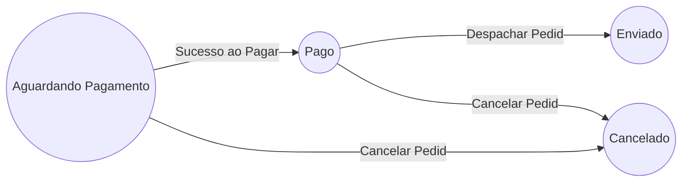
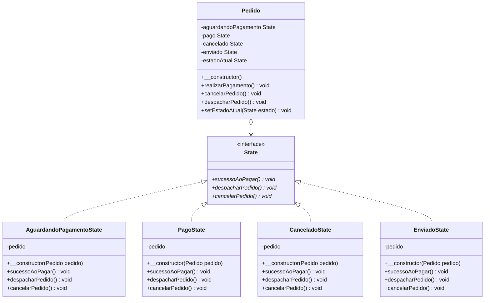
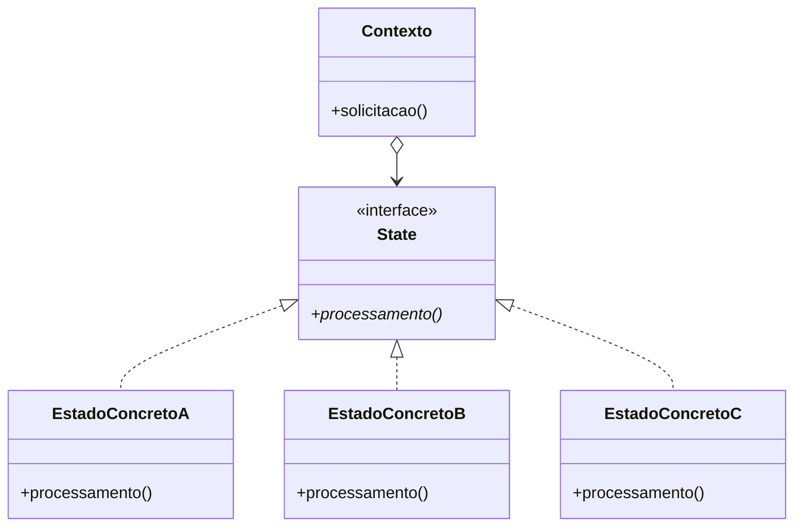

# State (padrão comportamental)

## Definição

O padrão de projeto _State_ permite que um objeto altere o seu comportamento quando o seu estado interno muda. O objeto parecerá ter mudado de classe.

## Motivação (Por que utilizar?)

Em alguns contextos de desenvolvimento de _software_ existem objetos que se comportam de forma diferente conforme o estado em que se encontram. Nestes casos pode ser muito trabalhoso gerenciar tais mudanças de estado, além de gerar classes enormes, com diversas operações condicionais que definem se é possível migrar de um estado para outro.

É comum encontrar classe com um atributo `estado` que utilizam valores inteiros ou constantes para representar o estado interno em que um objeto se encontra. Toda a lógica de transição entre estados costuma ficar na própria classe.

Considere um pedido em um _e-commerce_ onde tal pedido pode passar pelos seguintes estados:

> Máquina de estados

A máquina de estados nos diz que:

- Um pedido é inicializado no estado **Aguardando Pagamento**.
- Um pedido pode ir para o estado **Pago**, se e somente se, estiver no estado **Aguardando Pagamento** e a ação **Sucesso ao Pagar** for solicitada.
- Um pedido pode ir para o estado **Cancelado**, se e somente se, estiver nos estados **Aguardando Pagamento** ou **Pago** e a ação **Cancelar Pedido** for solicitada.
- Um pedido pode ir para o estado **Enviado**, se e somente se, estiver no estado **Pago** e a ação **Despachar Pedido** for solicitada.

O padrão _state_ sugere que cada um desses estados se torne um objeto de estado que irá compor o objeto de contexto (instância da classe **Pedido**). Um objeto de contexto é aquele que muda seu estado conforme o contexto em que se encontra, e por consequência muda seu comportamento. Deste modo o objeto de contexto parece ser uma instância de outra classe (a classe **Pedido** parecerá ter mudado de código), porém, tal mudança acontece devido a alteração do objeto de estado que o compõem.

Todos os objetos de estado devem assinar um contrato em comum, seja ele uma classe abstrata ou interface que contenha as solicitações que causam as mudanças de estado do objeto de contexto (**Pedido**). Isso garante a classe **Pedido** que todos os objetos de estado terão implementado os métodos (solicitações) que causam mudança no estado interno do pedido.

Dada a existência das classes de estado, quando uma determinada solicitação tenta mudar o atual estado interno do objeto de contexto (**Pedido**), ele delega para seu atual objeto de estado a responsabilidade de como tal solicitação deve ser tratada.

As classes de estado facilitam o gerenciamento das transições entre os estados de **Pedido**, previne que a classe cresça demais, e se torne difícil de entender e ainda simplifica o processo de inserção de novos estados.

> Diagrama de classes do exemplo (Getters foram ocultados)

## Aplicabilidade (Quando utilizar?)

- Quando o comportamento de um objeto depende do seu estado interno, e com base nele muda seu comportamento em tempo de execução.
- Quando operações possuírem instruções condicionais grandes que dependam do estado interno do objeto. Frequentemente várias destas operações terão as mesmas estruturas condicionais.

## Componentes

- **Contexto**: é a classe que pode ter vários estados internos diferentes. Ela mantém uma instância de uma subclasse **EstadoConcreto** que define seu estado interno atual. Sempre que uma solicitação é feita ao contexto, ela é delegada ao estado atual para ser processada.
- **State**: define uma interface (ou classe abstrata) comum para todos os estados concretos.
- **EstadoConcreto**: lidam com as solicitações provenientes do contexto. Cada **EstadoConcreto** fornece a sua própria implementação de uma solicitação. Deste modo, quando o contexto muda de estado interno o seu comportamento também muda.

> Diagrama de classes do padrão _State_ (genérico)

## Consequências

- O padrão _State_ encapsula o comportamento específico de um estado, e como o objeto de contexto deve se comportar em cada estado. O padrão coloca todo o comportamento associado a um estado específico em um objeto separado, assim, todo código referente a tal comportamento fica em uma subclasse **EstadoConcreto**. Novos estados podem ser adicionados facilmente, apenas definindo novas subclasses **EstadoConcreto**.
- As transições de estado se tornam explícitas. Quando um objeto define seu estado atual apenas em termos de valores de dados internos (constantes ou inteiros), suas transições de estado não têm representação explícita. Tais valores aparecem somente como atribuições para algumas variáveis.
- Estados podem proteger seu contexto interno de transições de inconsistências, porque as transições são processadas a nível de estado e não no objeto de contexto.
