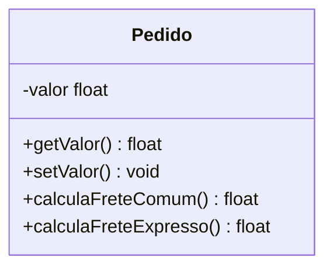
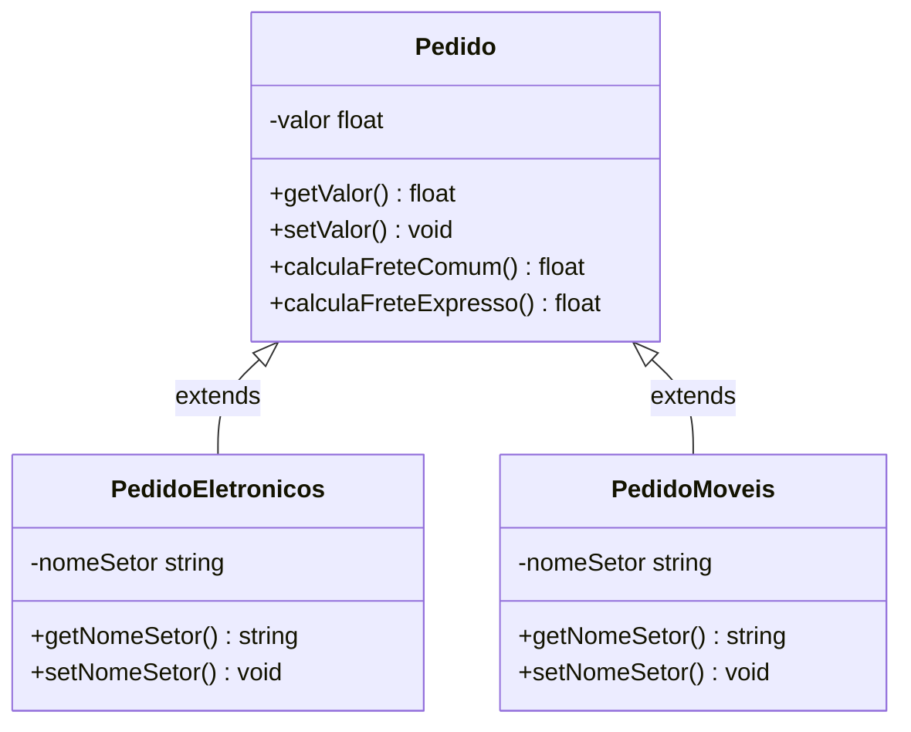
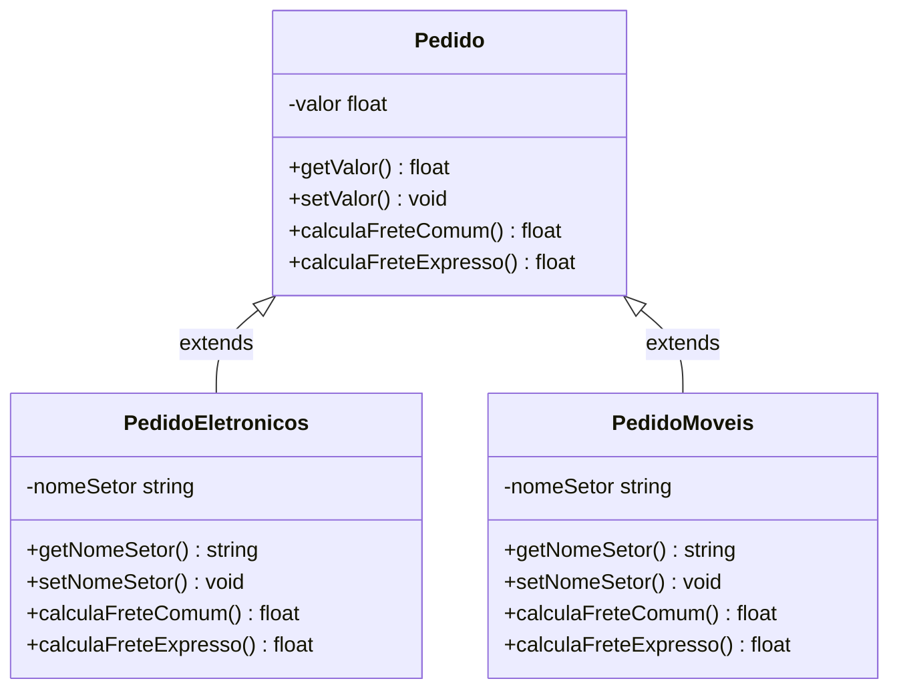
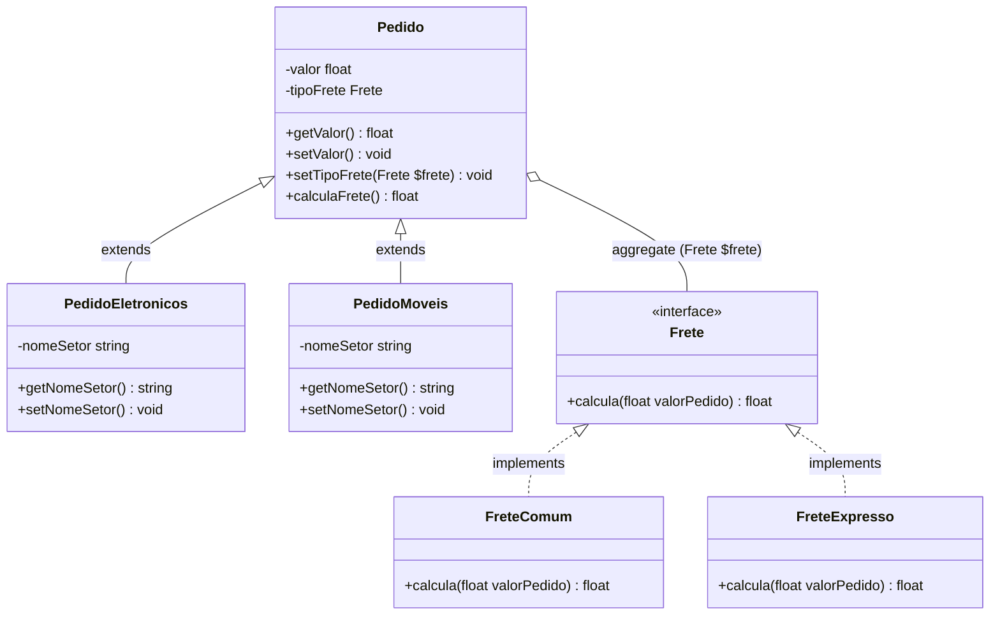
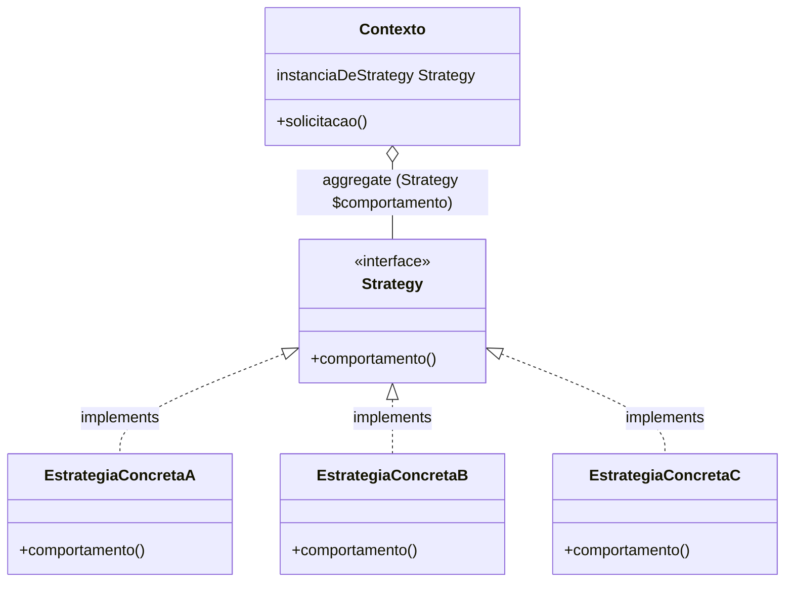

# Strategy (padrão comportamental)

## Definição

O padrao de projeto _Strategy_ define uma **família de algoritmos**, **encapsula** cada um deles e os torna **intercambiáveis**. O _Strategy_ permite que o algoritmo varie **independentemente** dos clientes que o utilizam.

## Motivação (Por que utilizar?)

O padrão _Strategy_ aprimora a comunicação entre objetos, pois passa a existir uma distribuição de responsabilidades. O objetivo é representar os comportamentos de um objeto por meio de uma família de algoritmos que os implementam.

Em projetos de _software_ orientados a objetos é possível encontrar objetos semelhantes que variam seu comportamento apenas em alguns pontos específicos. Cada um destes comportamentos pode ser externalizado em uma família de algoritmos.

Tome como exemplo o cálculo do valor de diferentes tipos de frete para um pedido realizado em um e-commerce. Os fretes disponíveis são **Frete Comum** e **Frete Expresso**. Todos os pedidos devem saber calcular seu frete.

Uma solução seria implementar os métodos de cálculo de frete na classe **Pedido**. No momento do cálculo do frete bastaria chamar o método responsável por calcular o frete escolhido.

Imagine que agora o e-commerce cresceu e foi dividido em setores. Os pedidos de cada setor possuem características diferentes, de modo a ser necessária a criação de uma classe de pedido para cada setor. Inicialmente existirão dois setores, móveis e eletrônicos. Neste caso basta transformar a superclasse **Pedido** em uma superclasse abstrata, que por sua vez implementa os métodos responsáveis por calcular os diferentes tipos de frete. Os pedidos de cada setor, que são subclasses, herdam as características da classe **Pedido**, e graças a herança também passam a saber calcular os diferentes tipos de frete.

Tudo certo até agora, mas considere que o setor de móveis fica em um estado do Brasil onde o frete comum é o único disponível. Temos um problema, pois devido a herança todas as subclasses de **Pedido** podem calcular todos os tipos de frete, porém, a subclasse **PedidoMoveis** deveria aceitar apenas o frete econômico.

É possível contornar isso tornando abstratos os métodos de cálculo de frete da classe abstrata **Pedido**. Assim, todos os subtipos de que herdam de **Pedido** serão obrigados a implementar seus próprios cálculos de frete.

Com essa solução, cada subpedido controla seus fretes e a subclasse **PedidoMoveis** pode bloquear o frete expresso dentro dela. A desvantagem dessa abordagem é que não existe reaproveitamento de código. Repare que o método `calculaFreteComum()` é exatamente igual nas duas subclasses, se ele mudar, todas as subclasses de **Pedido** deverão ser editadas. No momento existem apenas duas subclasses, mas imagine se forem dez. Essa edição de todas as subclasses além de ser muito trabalhosa pode permitir o surgimento de _bugs_ no processo.

O padrão _Strategy_ encapsula algoritmos que representam um comportamento similar, ou seja, isola o código que toma a decisão de modo que ele possa ser editado ou incrementado de forma totalmente independente.

Para utilizar o _Strategy_ em nosso problema, podemos começar com uma interface chamada de **Frete** que possui o método `calcula()`. Tal interface define uma família de algoritmos, onde cada membro dessa família é capaz de calcular um determinado tipo de frete.

Cada uma das classes implementam a interface **Frete**, portanto todas elas possuem o método `calcula()` que faz o cálculo conforme sua fórmula interna. Agora o cálculo de frete não fica mais na classe **Pedido** e nem em suas subclasses, este comportamento foi encapsulado em classes separadas.

Com a criação das classes de frete, basta adaptar a classe abstrata **Pedido** para que ela tenha os seguintes métodos:

- `setTipoFrete(Frete $frete)`: este método recebe como parâmetro um objeto que implementa a interface **Frete** e mantém a instância deste objeto em uma de suas variáveis internas.
- `calculaFrete()`: tal método é o responsável por invocar o método `calcula()` do objeto que foi recebido por `setTipoFrete(Frete $frete)`.

Com isso o algoritmo fica mais flexível, o tipo de frete passa a ser definido dinamicamente em tempo de execução. Além disso passa a obedecer alguns princípios básicos da OO:

1. **Programe para abstrações**: a classe **Pedido** não depende diretamente de nenhum calculador de frete concreto e sim da interface **Frete**.
2. **Open-closed principle**: o **Pedido** não terá nenhum impacto caso um novo tipo de frete seja aceito pelo e-commerce. Bastaria criar uma nova classe de frete que implemente a interface **Frete**.
3. **Dê prioridade a composição em relação à herança**: ao invés de herdar os cálculos de frete, os pedidos obtém a capacidade de calcular os fretes ao serem compostos pelo objeto do tipo **Frete** que lhe convém.

## Aplicabilidade (quando utilizar?)

- O padrão é aplicado quando muitas classes fazem a mesma coisa de forma diferente.
- Quando se necessita de variantes de um algoritmo.
- Quando é necessário evitar a exposição de dados ou algoritmos sensíveis os quais clientes não podem ter conhecimento.
- Remoção de operadores condicionais que determinam o comportamento do algoritmo com base em objetos diferentes.

## Componentes

- `Contexto`: classe que é composta por um objeto que implementa a interface **Strategy**. Ele é responsável por orquestrar as classes **EstrategiasConcretas**. Sempre que uma solicitação é feita à classe **Contexto**, ela é delegada ao objeto **Strategy** que a compõe.
- `Strategy`: contrato que as **EstrategiasConcretas** devem respeitar. Tal contrato será exigido pela classe **Contexto**.
- `EstrategiaConcreta`: lidam com as solicitações provenientes do **Contexto**. Cada **EstrategiaConcreta** fornece a sua própria implementação de uma solicitação. Deste modo, quando o **Contexto** muda de estratégia, o seu comportamento também muda.

## Consequências

- Família de Algoritmo: permite a criação de uma hierarquia de classes do tipo _Strategy_ em um mesmo contexto.
- O encapsulamento dos algoritmos nas classes _Strategy_ permite alterar o algoritmo independentemente do seu contexto, tornando mais fácil de efetuar possíveis alterações no código.
- É uma estratégia para remover operadores condicionais.
- Flexibilidade na escolha de qual _strategy_ (algoritmo) utilizar.
- Clientes devem conhecer as classes _Strategy_, pois se o cliente não compreender como essas classes funcionam, não poderá escolher o melhor comportamento.
- Custo entre a comunicação _Strategy_ e _Context_: as classes que implementam a interface _Strategy_ podem não utilizar as informações passadas por ela, ou seja, pode acontecer da classe _Contexto_ criar e iniciar parâmetros que não serão utilizados.
- Aumento do número de classes na aplicação.
