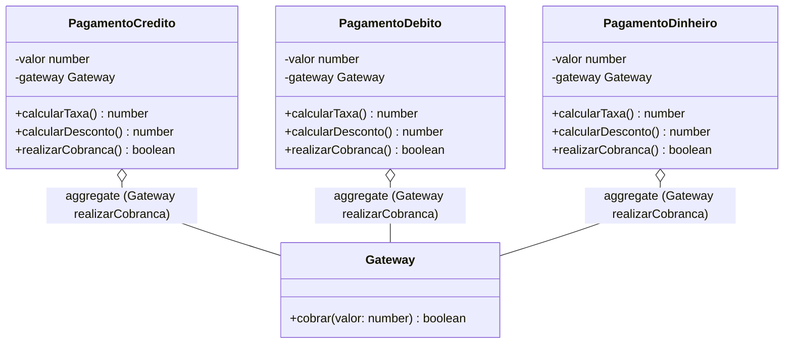
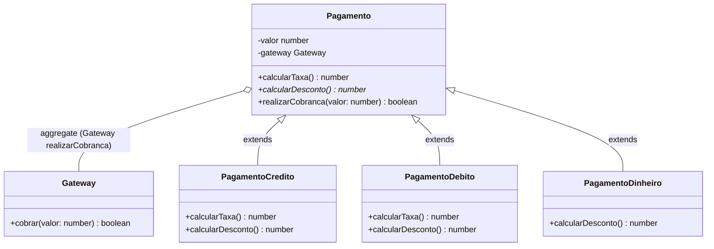
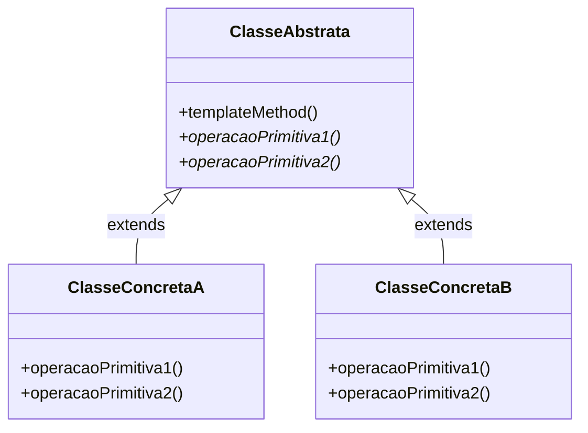

# Template Method (padrão comportamental)

## Definição

O padrão _Template Method_ define o esqueleto de um algoritmo dentro de um método, transferindo alguns de seus passos para subclasses. O _Template Method_ permite que as subclasses redefinam certos passos de um algoritmo sem alterar a estrutura do mesmo.

## Motivação (Por que utilizar?)

O padrão _Template Method_ auxilia na definição de um algoritmo que contém algumas de suas partes definidas por métodos abstratos. Subclasses são responsáveis por implementar as partes abstratas deste algoritmo. Tais partes poderão sr implementadas de formas distintas, ou seja, cada subclasse irá implementar conforme sua necessidade. Deste modo a superclasse posterga algumas implementações para que sejam feitas por suas subclasses.

Este padrão ajuda na reutilização de código e no controle de como o código deve ser executado.

Para exemplificar, considere o módulo de pagamentos do _software_ de uma loja de confecções, este módulo foi desenvolvido a alguns anos atrás e possui as seguintes classes.

> Diagrama de classes do exemplo no Cenario1 (sem _Template Method_)

As regras da loja para pagamentos são:

- Taxa
  - Crédito: 5% sob o valor.
  - Débito: acrescentar o custo fixo de 4 reais sob o valor.
  - Dinheiro: sem taxa.
- Desconto
  - Crédito: 2% somente sob valores maiores que 300 reais.
  - Débito: 5% sob o valor.
  - Dinheiro: 10% sob o valor.

A taxa é referente à cobrança feita pelo **Gateway** de pagamentos utilizado pelo _software_ da loja para realizar as cobranças. O método `realizarCobranca()` presente nas três classes é o responsável por delegar a cobrança ao serviço do **Gateway**.

O dono da loja de confecções está modernizando a loja e deseja aceitar novas formas de pagamento no futuro. Nossa tarefa é refatorar o módulo de pagamentos de modo que ele seja apto a aceitar novas formas de pagamento de maneira segura, sem afetar as formas de pagamentos já existentes, e minimizando as chances de surgimento de _bugs_.

É possível encontrar características comuns nas classes acima:

- Todas elas têm o método `realizarCobranca()` idêntico.
- Todas possuem um método para cálculo de taxas, mas são diferentes entre si.
- Todas possuem uma variável de instância `valor`.
- Todas mantêm uma referência a um objeto **Gateway**.

O método `realizarCobranca()` é quem dita como a cobrança será feita, é nele onde o algoritmo está implementado. Ele utiliza os métodos `calcularTaxa()` e `calcularDesconto()` que são a única variação entre uma classe e outra.

Existem alguns pontos importantes a serem observados na classe **Pagamento**:

- A variável de instância `valor` e referência a **Gateway** ficam agora na superclasse **Pagamento**. Todas as suas subclasses já terão esses recursos disponíveis.
- O método `calcularDesconto()` foi declarado como abstrato, deste modo é responsabilidade das subclasses o implementar conforme suas regras específicas.
- O método `calcularTaxa()` é um hook (gancho). Trata-se de um método que é implementado na classe abstrata mas recebe apenas uma implementação vazia, ou mínima possível como padrão. No nosso exemplo isso é útil devido ao fato que a classe **PagamentoDinheiro** não tem incidência de cobrança de taxa, assim ela pode utilizar a implementação padrão do método que retorna 0. Já as classes **PagamentoCredito** e **PagamentoDebito** deverão sobrescrever este método conforme suas regras específicas.

> Diagrama de classes do exemplo no Cenario2 (com _Template Method_)

Quem dita as regras a respeito de como uma cobrança será feita é o método `realizaCobranca()` da superclasse **Pagamento**. Cabe às subclasses completar as peças do quebra-cabeças.

Na nova implementação não existe mais código repetido, as subclasses complementam a classe pai com os comportamentos que variam. Isso causa uma inversão de dependência que diz _"Abstrações não devem ser baseadas em detalhes. Detalhes devem ser baseados em abstrações"_. É exatamente o que estamos fazendo, pois os detalhes de cada tipo de pagamento dependem da classe abstrata **Pagamento** e não o contrário.

Se no futuro a loja decidir adotar um novo meio de pagamento, como pagamento via _smartphone_ por exemplo, basta criar uma nova classe **PagamentoSmartphone**, estender a classe **Pagamento** e implementar suas especificidades. Deste modo não será necessário modificar a classe **Pagamento** que está seguindo outro princípio de Orientação a Objetos, ela está _"aberta para extensão mas fechada para mudanças"_.

## Aplicabilidade (Quando utilizar?)

- Para implementar partes invariantes de um algoritmo apenas uma vez, deixando para as subclasses apenas a implementação daquilo que pode variar.
- Controlar extensões de subclasses, sabendo o que as subclasses devem implementar e até onde devem implementar.
- Evitar duplicação de código entre classes comuns.

## Componentes

- **ClasseAbstrata**: Superclasse abstrata que contém os métodos concretos e abstratos que serão comuns a todas suas subclasses. Implementa o `templateMethod()` que define o esqueleto de um algoritmo.
- **ClasseConcreta**: Classes que herdam os métodos concretos de **ClasseAbstrata** e implementam os métodos abstratos conforme suas especificidades.

## Consequências

Os _Template Methods_:

- São uma técnica fundamental para a reutilização de código. São particularmente importantes em bibliotecas de classes, pois são os meios para definir o comportamento comum nas classes das bibliotecas.
- Proporcionam a inversão de dependência. Isso se refere a como uma classe pai chama as operações de uma subclasse e não o contrário.
- Permitem controlar a sequência da execução de métodos das subclasses.
- Possibilitam ter pontos que chamam código ainda não implementado.
- Podem chamar os seguintes tipos de operações:
  - Métodos Concretos: implementados na própria classe abstrata onde o _Template Method_ se encontra.
  - Métodos Abstratos: implementados nas subclasses.
  - Operações primitivas e funções da linguagem.
  - Outros _Template Methods_.
  - Hooks.
